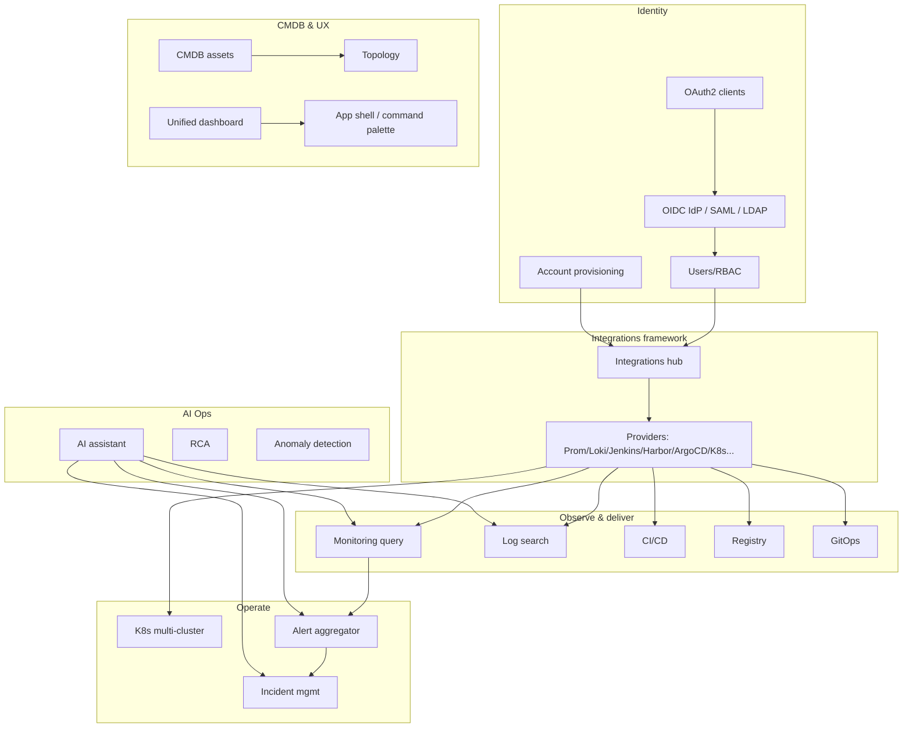

# KkOps v2 Capability Overview

This document summarizes the v2 “intelligent operations hub” capability map: centralized identity, external integrations, alerting and incidents, Kubernetes and GitOps, AI-assisted operations, and CMDB with dashboard/shell UX.

## Capability pillars

| Area | Purpose | Main surfaces |
|------|---------|-----------------|
| **Identity & provisioning** | SSO/RBAC, OIDC IdP, SAML/LDAP stubs, OAuth2 clients, account sync targets | Integrations (credentials), Provisioning, OAuth2 / IdP apps, SSO docs |
| **Integrations hub** | Encrypted connector configs, provider registry, health checks | `/integrations`, backend `internal/integration/` |
| **Observability tooling** | Metrics (Prometheus/Nightingale), logs (Loki/Elasticsearch), CI/CD (Jenkins/GitLab), Harbor, Argo CD | Monitoring, Logging, CI/CD, Registry, GitOps UI routes |
| **Alerts & incidents** | Normalized alerts, webhook ingestion, incident lifecycle | Alert Center, Incidents, `ALERTS_WEBHOOK_SECRET` |
| **Kubernetes & GitOps** | Multi-cluster kubeconfig integrations, cluster browsing, Argo CD pipeline view | K8s pages, GitOps pipeline view |
| **AI Ops** | Provider abstraction, chat, RCA reports, anomaly rules/findings | AI menu (`ai:*` permission) |
| **CMDB & topology** | CI/assets/relations, topology page | CMDB assets, Topology |

## Architecture diagram

## Related documentation

See [docs/README.md](../README.md) for the full index (SSO, IdP, dashboard data, deployment).

## OpenSpec

Implemented capabilities are captured under `openspec/specs/`; completed change proposals live under `openspec/changes/archive/`.
